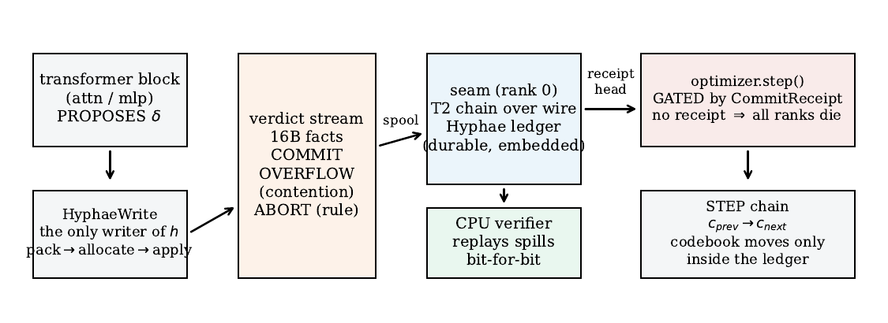
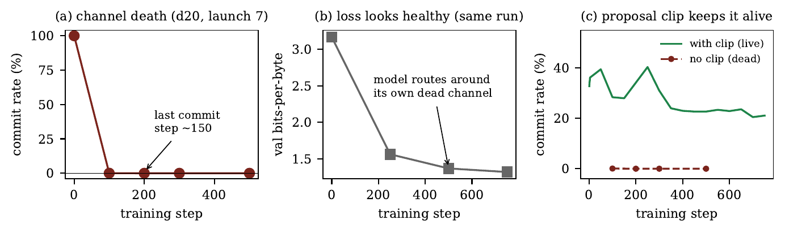
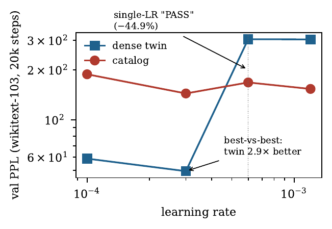
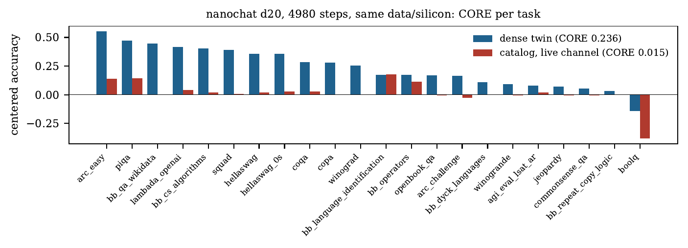
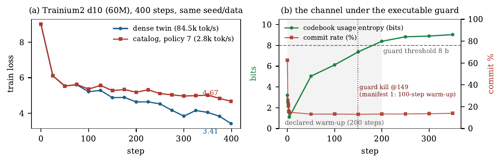

# hytorch — a transactional residual stream for transformer training

[](LICENSE)
[](LICENSE-CC-BY-SA-4.0)
[](paper/main.pdf)
[](https://github.com/Hyphae-Research-Foundation/hytorch/releases/tag/v1.1)
[](https://github.com/Hyphae-Research-Foundation/hytorch/actions/workflows/ci.yml)
[](rust-toolchain.toml)
[](python/pyproject.toml)
[](CITATION.cff)

**The residual stream of a transformer is its only inter-layer medium, and in every
production training stack it is an anonymous accumulator: any kernel may execute
`h += δ`, and no record of the write survives the step.** Training observes the
*consequences* of internal writes — loss curves, evaluations, activation probes — never the
writes themselves. hytorch makes the writes the unit of record: blocks **propose** deltas; a
pinned policy admits them against a learned codebook, one winner per slot; and every
candidate write leaves exactly one 16-byte record — `COMMIT`, `OVERFLOW` (lost a slot
contention) or `ABORT` (rule rejection) — so that what the model *attempted* to write, and
why it was refused, is data. `optimizer.step()` is legal only after the step's records have
a durable commit receipt, and a CPU-only verifier replays any audited microbatch bit-for-bit
against a pinned software reference. The same reference binary admits NVIDIA, AMD and AWS
Trainium2 kernels.

**What this is, and is not.** hytorch is an *instrumentation and verification framework*
for training — it gives a training process **observability** (which writes occurred and
which were refused), **auditability** (tamper-evident receipts) and **replayability**
(bit-exact CPU replay). It is not an efficient training architecture: the channel
configuration we tested does not carry a language model and costs 12–29× the dense twin's
wall clock, and we say so up front. Its value so far is what the instrument saw: a
load-bearing internal pathway dying completely while every conventional signal said the
training was healthy, and our own headline result reversing under a preregistered protocol.

> Paper: [`paper/main.pdf`](paper/main.pdf) — *The Missing Medium: A Transactional
> Residual Stream for Transformer Training* (v1.1, 10 pp, reframed after four external
> reviews — see [`paper/notes/REVIEWS-2026-09.md`](paper/notes/REVIEWS-2026-09.md)). Every
> number in it maps to a file under [`results/`](results/) or a record key in a Hyphae ledger.

| | |
|---|---|
| Code | [Apache License 2.0](LICENSE) |
| Documentation, paper, figures, results prose | [CC BY-SA 4.0](LICENSE-CC-BY-SA-4.0) |
| Status | Research prototype. Phases 1–5 and the Trainium2 port are complete; the headline capacity number comes from a run with a later-found gradient bug (see [Results](#results)) and the corrected rerun does not exist. |

---

## Contents

1. [What hytorch does](#what-hytorch-does)
2. [Results](#results)
3. [How it works — the technologies](#how-it-works--the-technologies)
4. [Repository map](#repository-map)
5. [Build and test](#build-and-test)
6. [Reproducing the figures and the paper](#reproducing-the-figures-and-the-paper)
7. [Operating a run](#operating-a-run)
8. [What is not done](#what-is-not-done)
9. [Licensing and citation](#licensing-and-citation)

---

## What hytorch does



*Figure 1 — The seam. Blocks propose; `HyphaeWrite` is the only writer of the residual.
The verdict stream (16-byte facts: commits, contentions, rule rejections) is spooled to a
rank-0 seam that chains it (T2) into an embedded Hyphae ledger. The optimizer is gated by
the commit receipt; the codebook may move only inside the ledger. A CPU verifier replays
audited microbatches bit-for-bit.*

Five laws define the design:

- **Law 0 — single writer, declared exceptions.** Inside a block the catalog write is the
  only mutation of `h`; attention and MLP outputs are proposals. Residual mutations the
  host architecture carries outside the block (nanochat's per-layer scalars) are declared
  in the manifest and journalized every step as `BYPASS` facts.
- **Law 1 — typed writes.** A write is a binding `(pos, slot, feature, mag)`: a bf16
  magnitude along one unit-normalized codebook row, applied to one slot of one token.
- **Law 2 — verdicts are facts.** Every candidate leaves exactly one fact: `COMMIT`,
  `OVERFLOW` (lost a slot collision) or `ABORT` (nonfinite, magnitude cap, policy denial).
  `#C + #O + #A = k`, always. The negative space is journalized, not dropped.
- **Law 3 — receipts gate the step.** All ranks spool their frames; rank 0 waits for the
  ledger's commit receipt and broadcasts its head; a missing receipt kills all ranks.
- **Law 4 — replayability.** A bf16 bit-contract (promote, fp32 sequential no-FMA
  reductions, round-to-nearest-even downcast, canonical NaN) is pinned in a reference
  object whose SHA-256 every run cites.

## Results

All numbers below are in the paper with their evidence paths; the headline ones:

| Claim | Number | Evidence |
|---|---|---|
| Cross-vendor bit-exactness (NVIDIA sm_89/sm_90, AMD gfx950) | 200,000 adversarial cases, byte-identical verdicts and residuals | `results/gates/` |
| Fault injection over real training spills | 36/36 mutations detected, correct failure class each | `results/inject/inject-summary.json` |
| Seam overhead (spool + chain + commit) | 9.5 % wall at 20k steps on one GPU; ~5 % amortized at d20×8 ranks (335M facts/step) | `results/train/`, `results/nanochat/` |
| Preregistered LR sweep | reversed our own −44.9 % PPL headline: the tuned dense twin is 2.9× better | `results/train/NVIDIA-H200/lrsweep-*` |
| **Silent channel collapse (the finding)** | commit rate 0.066 % → 0 by step 200 while validation loss improved on schedule | `results/nanochat/PHASE5-CHANNEL-COLLAPSE.md` |
| Price of a *live* typed channel, nanochat d20, 4,980 steps, 8×MI355X | CORE 0.015 (catalog) vs 0.236 (dense twin); 15.0 vs 1.2 s/step. **Caveat:** the catalog run trained with a mis-scaled STE gradient found later; the corrected rerun does not exist | `results/models/d20-p5/RESULT.md`, S3 |
| Third silicon: AWS Trainium2, d10 (60M), 400 steps, DDP | loss 4.667 vs 3.414; channel alive (commit 13–14 %, abort 0 %, usage entropy 9.0 b); 400/400 receipts; 2.8k vs 84.5k tok/s | `results/trn2-d10/RESULT.md`, S3 |

### The finding: a channel can die while training telemetry reads healthy



At nanochat-d20 scale the ledger recorded a *total, silent* channel collapse: proposals
demanded up to 58,000× the magnitude cap, commits went to exactly zero, the codebook froze
bit-exactly — and the loss curve kept improving normally, because nanochat's bypass scalars
let the model learn *around* its dead channel. No loss curve, eval, or activation probe
distinguishes "expensive channel" from "dead channel with bypass"; the write records do,
mechanically, during training. This is not a discovery of collapse — VQ codebooks and MoE
routers collapse, and the literature has remedies — and not yet a law of the residual
stream (the host, nanochat, carries the loss through declared bypass scalars; a pre-LN
architecture without them might break instead of hiding). The fix (a per-slot
proposal-norm clip) and the executable preregistered guard (usage entropy and commit rate,
sustained window, kills all ranks) are in the code.

### The protocol works, including against us



The preregistered LR sweep reversed a cross-vendor-replicated −44.9 % perplexity win: the
dense twin at its own best LR is 2.9× better. What survives is different — the catalog is
6× more LR-robust and 7× more seed-stable — and we publish the reversal.

### The price of a live typed channel



With the channel verifiably alive for a full compute-optimal d20 run (commit 19–40 %, zero
aborts, 3.4×10⁸ verdict records per step for 22 hours; chains and counts durable every step,
raw records sampled 1/100) the cataloged model is at chance on every knowledge- or
reasoning-bearing task. Two caveats travel with that number: the run trained with an STE
gradient we later found to be mis-scaled (the proposal clip was applied outside the graph),
and no capacity control exists (no k sweep, no matched dense bottleneck). The supported
statement is that *the configuration tested* — k=8 commits of 20-dimensional unit vectors
into 64 slots, at most 160 scalar degrees of freedom per token per layer against 1,280 — is
too narrow; the conclusion rests on those degrees of freedom, the loss plateau and the
bypass scalars carrying the trunk, not on the contaminated CORE alone.

### Third silicon



On Trainium2 no custom kernel exists, so a two-phase policy is used: the device proposes
candidates (never trusted), the host reference disposes exact verdicts, facts remain
bit-exactly verifiable. The typed channel trains under DDP with every step receipted. The
executable guard fired twice on the way (once on a proposer tie-break bug of ours — the
collapse of the finding above, caught live; once as the declared negative of the first
manifest, whose 100-step warm-up was too short for a rising entropy). The completed run is
reported under a second manifest declared before it ran.

## How it works — the technologies

### The catalog: a vector-quantized write vocabulary
The residual `h ∈ ℝ^D` is split into `S` slots of `d_slot` dimensions (`D = S·d_slot`). A
codebook `C ∈ ℝ^{N_f × d_slot}` (e.g. 32,768 × 20) holds unit-normalizable rows; feature
`f` has a home slot `σ(f) = f mod S`. For each token the policy scores every feature
against its home-slot leaf of the proposal, keeps the top-*k* by `(score desc, feature asc,
slot asc)`, allocates one winner per slot (`OVERFLOW` for the losers) and rejects nonfinite
or over-cap magnitudes (`ABORT`). Applying a commit means
`h[slot] ← bf16(h[slot] + mag · ĥ(C[f]))`. The codebook is trained through a
straight-through estimator whose closed-form mirror gives `∂L/∂C`, `∂L/∂mag` and
`∂L/∂leaf` from the committed set only (`python/hytorch/model.py`). This is a VQ-VAE-style
bottleneck (cf. Codebook Features) trained as a *transactional* object: writes carry
verdicts, and no verdict is trusted without the reference.

### The pinned reference: `apply-ref`
`crates/apply-ref` is the policy — pack → allocate → apply — written once in Rust as a
bit-exact software semiring over bf16/fp32: promote bits, sequential fp32 reductions with
no fused multiply-add, RNE downcast, `NaN → +qNaN` canonicalization before ordering. It is
compiled to `libapply_ref.so`; the trainer (via ctypes, `python/hytorch/applyref.py`) and
the verifier link the *same* object, and its SHA-256 is recorded in every run's
`build` facts.

### Device kernels and the differential gate
`kernels/cuda` holds CUDA/HIP kernels for pack/allocate/apply, compiled with
`-fmad=false / -ffp-contract=off`, using a packed `(key, feature)` comparator so a parallel
argmax reproduces the reference's sequential tie-break. A kernel is *admitted* per silicon
only after `diff_harness.cu` runs 200,000 adversarial cases (seven generator families:
NaN/Inf floods, denormals, cap boundaries, tie storms, …) with byte-identical verdict
records and residuals against `apply-ref` (`infra/gate-diff.sh`, `results/gates/`).

### Facts, wire and chain: `binding-wire`
A verdict is a 16-byte `BindingMin` (or the 80-byte `BindingT15` for audited spills):
position, slot, feature, bf16 magnitude, verdict, reason. Frames of facts per layer are
chained with SHA-256 (the T2 chain); the chain head after a step is the receipt. The
receipt is *tamper-evident* (any drop, reorder, injection or bit-flip is detected — the
36/36 injection result), not *unforgeable* (an adversary who owns the seam process could
fabricate a consistent chain; keying or external anchoring is a straightforward extension
not built here).

### The seam and the ledger: `seam` + Hyphae
Authority (the trainer computes) is separated from durability (the ledger remembers).
`crates/seam` (`hytorch-seam`) is a rank-0 process that consumes per-layer wire frames
from a spool, walks the T2 chain, and commits `{layer records, receipt, STEP chain}`
transactionally into an embedded [Hyphae](https://crates.io/crates/hyphae-engine)
store (`hyphae-engine` 2.2). The protocol has two phases per step: **A** — ranks spool,
barrier, `RECEIPT` gates `optimizer.step()`; **B** — after the step the codebook's
`c_prev → c_next` hashes, `CODEBOOK_RESET`, `BYPASS` and `POLICY` records are chained. The
executable guard lives here too: commit rate and usage entropy against the manifest
thresholds over a sustained window; crossing kills every rank. `hytorch-ledger-query`
dumps wire and records for analysis (`python/hytorch/ledger_analysis.py`).

### The verifier
`crates/verifier` (`hytorch-verify`) runs on a CPU with no GPU: **T1** replays audited
microbatch spills through the same `libapply_ref.so` and compares residual bits; **T2**
walks the chain. Fault injection (`python/tests/test_inject.py`) mutates real spills in six
classes and checks that each is caught with the right failure class.

### Preregistration as code
`manifests/*.json` fix, before step 0, the policy, the data (sha256 of the token bins),
the thresholds and the comparison. A promised threshold must exist as a guard in the same
commit; the guard reads the manifest and its hash is committed in `RUN_START`. This is
what reversed our own headline (LR sweep) and what killed two Trainium runs correctly.

### Two-phase selection for silicon without kernels (policy 7)
On XLA/Trainium the device *proposes*: bf16 matmul scores against the codebook grouped by
home slot, top-*M* candidates per token — never trusted. The host reference *disposes*:
it recomputes the *M* candidate scores with the pinned math and runs the unchanged policy
machinery; a bridge test proves `M = N_f` is byte-identical to the exact policy. Proposal
completeness becomes a measured miss-rate with a preregistered threshold
(`python/hytorch/neuron_backend.py`, `python/tests/test_two_phase*.py`). Six Neuron
compiler limits had to be routed around (documented with a compile-only bisection recipe
in `results/gates/AWS-Trainium2/NOTES.md`); none changed what is verified.

### Journaled inference
The same seam runs at generation time (`python/hytorch/runtime.py`): each emitted token
carries the facts behind it, a confidence signature computed from those facts against
training priors (`signatures.py`, F1–F9), and — above a calibrated threshold — a
`LOW_CONFIDENCE` fact committed *before* the token is emitted. A dead ledger degrades
visibly (tokens marked uncitable), never silently. This is an instrument and a hypothesis, not a result:
the hallucination study it enables is designed and preregistered
(`docs/phases/PHASE4-MECHANISM.md`) but not run, and nothing here measures confabulation.

### Integration with real training
hytorch integrates into [nanochat](https://github.com/karpathy/nanochat) by an additive
patch against a pinned commit (`nanochat/apply-patch.sh`, `nanochat/hytorch_bridge.py`,
`nanochat/seam_shim.py`): with `HYTORCH_CATALOG` unset the tree is bit-identical to
upstream, and that same tree is the dense-twin arm. The Trainium variant is `trn/`. Runs
were operated on DigitalOcean spot GPUs (8×MI355X, B300) and an AWS trn2.3xlarge via the
scripts in `infra/` (provision, supervise, watchdog, custody to S3, teardown); the
invariants learned in blood are in [`infra/RUNBOOK.md`](infra/RUNBOOK.md).

## Repository map

| Path | What it is | License |
|---|---|---|
| [`crates/apply-ref`](crates/apply-ref) | The pinned policy: bit-exact pack/allocate/apply, `libapply_ref.so` | Apache-2.0 |
| [`crates/binding-wire`](crates/binding-wire) | 16 B / 80 B fact formats, verdicts, T2 chain | Apache-2.0 |
| [`crates/seam`](crates/seam) | `hytorch-seam` (spool → chain → Hyphae → receipts, executable guard), `hytorch-ledger-query` | Apache-2.0 |
| [`crates/verifier`](crates/verifier) | `hytorch-verify`: T1 replay, T2 walk, CPU-only | Apache-2.0 |
| [`kernels/cuda`](kernels/cuda) | CUDA/HIP kernels + the 200k-case differential harness | Apache-2.0 |
| [`python/hytorch`](python/hytorch) | Law-0 block, `HyphaeWrite` (STE), two-phase backend, seam client, runtime, signatures, probes | Apache-2.0 |
| [`python/tests`](python/tests) | The six CI suites (spill round-trip, e2e seam, injection, runtime, two-phase, semantics probe) | Apache-2.0 |
| [`nanochat/`](nanochat), [`trn/`](trn) | Integration patches and bridges for nanochat (GPU) and the Trainium tree; `trn/tools` compile-only bisection, `trn/runs` launchers | Apache-2.0 |
| [`infra/`](infra) | Provision / supervise / watchdog / custody / teardown scripts, CI runner, RUNBOOK | Apache-2.0 |
| [`manifests/`](manifests) | Immutable preregistered manifests (thresholds signed before step 0) | Apache-2.0 |
| [`results/`](results) | Custody of every result: gates, training runs, injection, models, Trainium; large binaries live in S3 with sha256 lists | CC BY-SA 4.0 |
| [`paper/`](paper) | `main.tex` / `main.pdf`, `make_figs.py`, `figs/`, working notes | CC BY-SA 4.0 |
| [`docs/`](docs) | Spec lineage (Spanish, with its full correction registry), amendments, phase designs, operator handoff | CC BY-SA 4.0 |

## Build and test

Requirements: Rust (stable, see `rust-toolchain.toml`), Python ≥ 3.11 with `torch numpy
pyarrow matplotlib pytest`, and for device paths CUDA ≥ 12 / ROCm ≥ 6 / Neuron SDK 2.26.

```bash
cargo build --workspace --release          # libapply_ref.so, hytorch-seam, hytorch-verify, hytorch-ledger-query
cargo test  --workspace --release          # 51 tests

python -m venv .venv && .venv/bin/pip install torch numpy pyarrow matplotlib pytest
cd python
../.venv/bin/python -m pytest tests/test_spill_roundtrip.py tests/test_e2e_seam.py \
    tests/test_inject.py tests/test_runtime.py tests/test_two_phase.py          # CPU only, ~1 min
```

`test_two_phase.py` is the two-phase gate (G1 bridge byte-identity, G2 apply replay, G3
pipeline invariants, G4 miss-rate, G5 two-stage ≡ global top-*M* incl. exact ties, G6 flat
clip, G7 host codebook grad). `test_two_phase_device.py` runs the same gate on an
accelerator. Remote CI over the six suites: `infra/ci-remote.sh`.

## Reproducing the figures and the paper

```bash
cd paper
../.venv/bin/python make_figs.py            # all figures → figs/*.pdf and figs/png/*.png
~/.local/bin/tectonic main.tex              # or any LaTeX with the packages in the preamble
```

Every figure function names the `results/` file it reads in its header comment.

## Operating a run

Start with [`docs/HANDOFF.md`](docs/HANDOFF.md) (state, credentials map, open items) and
[`infra/RUNBOOK.md`](infra/RUNBOOK.md) (invariants and incidents). The rules that cost the
most to learn: never `pkill -f <pattern>` from a shell whose command line contains the
pattern; nothing unbounded may sit between the trainer and its receipt; a promised
threshold must exist as code in the same commit; any transform the policy judges must be a
transform autograd sees; custody before teardown, and custody must exit nonzero on any gap.

## What is not done

- **A rerun of the d20 pretraining with the corrected STE mirror.** A gradient bug (the
  proposal clip applied to the detached input, so its Jacobian was missing from the STE
  mirror) was found during SFT and fixed; the phase-5 pretraining ran with it. Records and
  receipts are unaffected; CORE 0.015 is the result of *that* run. The Trainium d10 run is
  a corrected-mirror run at a smaller scale.
- **Capacity controls.** One policy point only: no sweep over k (8→16→32→64), slot width
  or N_f; no catalog-as-side-channel arm; no dense bottleneck of matched degrees of freedom.
- **The hallucination study.** Instrument and preregistered design exist; the cataloged
  model has no knowledge to confabulate about (CORE at chance), so the study needs a wider
  channel trained at scale.
- **A two-pass forward for XLA** (propose every unit → dispose once → apply once) to cut
  the 29× host round-trip cost of two-phase selection.
- **Unforgeable receipts** (keyed or externally anchored chain heads).
- **CORE evaluation of the d10 checkpoints** (both in S3).

## Acknowledgements

hytorch trains inside [**nanochat**](https://github.com/karpathy/nanochat) by
**Andrej Karpathy** — the full-stack, from-scratch LLM training pipeline (tokenizer, data,
pretraining, SFT, CORE evaluation) that made phases 3–5 possible on a small budget. Every
d12/d20 number in this repository and in the paper was obtained with nanochat as the host
trainer and the *dense twin* is unmodified nanochat; the CORE evaluation is nanochat's
`base_eval`. We integrate by an additive patch against a pinned commit so that the baseline
arm is upstream nanochat bit for bit, and we redistribute none of it. Thank you.

The Trainium2 work ran on the AWS Neuron team's nanochat competition tree and toolchain
(Neuron SDK, torch-xla), and the AMD runs on DigitalOcean's MI355X spot capacity. The
verification design owes its vocabulary to the database and distributed-systems literature
(transactions, receipts, write-ahead journals), and its discipline to the preregistration
practice of the empirical sciences.

## Licensing and citation

Source code is licensed under the [Apache License 2.0](LICENSE). Documentation, the paper,
its figures and the prose under `results/` are licensed under
[CC BY-SA 4.0](LICENSE-CC-BY-SA-4.0). See [`NOTICE`](NOTICE) for third-party components.

```bibtex
@techreport{hytorch2026,
  title  = {The Missing Medium: A Transactional Residual Stream for Transformer Training},
  author = {{Hyphae Research Foundation}},
  year   = {2026},
  month  = {September},
  note   = {Version 1.0. Code: \url{https://github.com/Hyphae-Research-Foundation/hytorch}}
}
```
