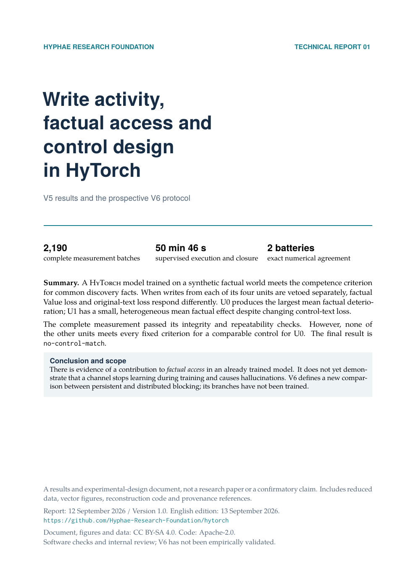

# Write Activity, Factual Access, and Control Design in HyTorch

**V5/V6 technical report · September 12, 2026 · version 1.0**

**English edition: September 13, 2026.** This translation uses the same measurements and sources; its publication date does not mark a new scientific result.

[English](README.en.md) · [Español](README.md)

[Read the English PDF](report-en.pdf) · [English LaTeX source](report-en.tex) · [Data and provenance](data/README.en.md) · [Full V6 protocol in English](design/PROTOCOL.en.md) · [English figures](figures/en/)

[](report-en.pdf)

The V5 measurement completed 2,190 batches and two batteries with identical numerical results. U0 ranked first in the factual localizer, but none of the other sites met all the predefined comparability criteria: **`no-control-match`**. The report preserves this result and presents the variation across facts and position maps.

The reference achieved 94.74–100% accuracy on common discovery facts; its accuracy across all questions was 49.22–54.69%. The figures show both scopes and their denominators. Accuracy on the common subset is not presented as overall accuracy.

V6 is a **prospective protocol with no training executed**: 17 arms comparing persistent/concentrated blocking with distributed interruptions and rescue. The schedule balances assigned sites; it does not guarantee equal general damage during the training trajectories. These results do not yet demonstrate that channel death during learning causes hallucinations.

## Contents

- An eleven-page English LaTeX technical report with five vector figures and PNG versions, alongside the eleven-page Spanish edition.
- Competence by stratum, effects by unit and position, matching criteria, and heterogeneity across the 19 common facts.
- Complete reduced tables and an exact copy of the historical selector for recomputing selection.
- The complete V6 protocol, code, and schedule, with verifiers that do not load models.
- Provenance linking hashes of the originals to their portable exports. Both language editions use the same data and scientific sources.

## Verification without scientific dependencies

From this directory, using Python 3:

```bash
make verify
```

This recomputes the aggregates and selection for both batteries and verifies the V6 plan. It does not execute Torch, training, factual generation, or Native queries. The expected selector result is `no-control-match`.

## Rebuilding the English PDF and figures

The original build was verified with Python 3.14, Matplotlib 3.11.1, NumPy 2.5.2, and Tectonic 0.15.0. Tectonic must be available on `PATH`; it may download the required TeX packages during the first build.

```bash
python3 -m venv .venv
.venv/bin/python -m pip install -r requirements.txt
make pdf-en PYTHON=.venv/bin/python
```

The English PDF is written to `report-en.pdf`; temporary build files and logs are kept under `build/`. The five English figures in `figures/en/` are rebuilt exclusively from `data/report-data.json`. The complete scientific tables are included as a deterministic gzip archive.

The [original publication validation](validation.json) records the Spanish build in a clean checkout: 11 pages, all fonts embedded, no layout warnings, and 62 passing schedule tests. Its PDF and images matched byte for byte between the two directories. These are the recorded checks for that release, not a claim that translating the report performs a new scientific validation. The English-edition build and translation checks are documented separately in [validation-en.json](validation-en.json).

[artifact-manifest.json](artifact-manifest.json) records the bilingual deliverables with their separate file hashes. [artifact-manifest.es-v1.json](artifact-manifest.es-v1.json) preserves the original Spanish manifest. Translations have their own hashes; the evidence references continue to identify the original sources.

The archived manifest describes the [first Spanish release](https://github.com/Hyphae-Research-Foundation/hytorch/tree/c6ba5411cb0d265503f0be4eabd86d4b26025403/reports/factual-channels-2026-09-12), not the updated bilingual scripts and navigation. The original Spanish PDF, figures and scientific data retain their published bytes.

`make preview-en` also rebuilds the English cover image used in this README and requires `pdftoppm` (Poppler). The English technical build date uses `EN_SOURCE_DATE_EPOCH`, passed to Tectonic as `SOURCE_DATE_EPOCH`; it is not a new measurement date. `make bilingual` rebuilds both PDFs, figures and cover previews. The Spanish PDF, source, figures, and preview remain available through the [Spanish edition](README.md).

The original mechanical schedule tests are included in `design/test_control_schedule.py`. To run them, also install `pytest` in the environment and use:

```bash
.venv/bin/python -m pytest -q -p no:cacheprovider design/test_control_schedule.py
```

## Reproducibility scope

The package supports rebuilding figures and aggregates, verifying published files, and recomputing the decision from the complete tables. **It does not include** the original raw files, checkpoints, or ledgers. The historical readback counter recorded approximately 19.66 GB read; that figure is not the combined size of all that evidence. Verification of the tables is not presented as revalidation of those originals or as neural replay.

`data/export_data.py` can compare the export against the available pinned source JSON files and documents in a historical workspace; it does not revalidate raw blobs, checkpoints, or ledgers. The current provenance manifest identifies 42 original sources. A clean clone uses the included portable data and does not need those originals for `make verify` or `make pdf-en`. Provenance paths are relative to the repository; they do not guarantee that every historical artifact is published on this branch.

Numerical qualification and integration of the V6 runner remain pending. Its base estimate of roughly 56 CPU hours for 17 arms is a historical extrapolation; it excludes parts of qualification, new curves, diagnostics, and retention.

## Licenses

Report, figures, and data: [CC BY-SA 4.0](../../LICENSE-CC-BY-SA-4.0). Code: [Apache-2.0](../../LICENSE). Historical copies retain their original contents and hashes. The [English protocol translation](design/PROTOCOL.en.md) identifies its unchanged Spanish source. This release documents results and design; it is not external peer review or confirmatory causal evidence.
