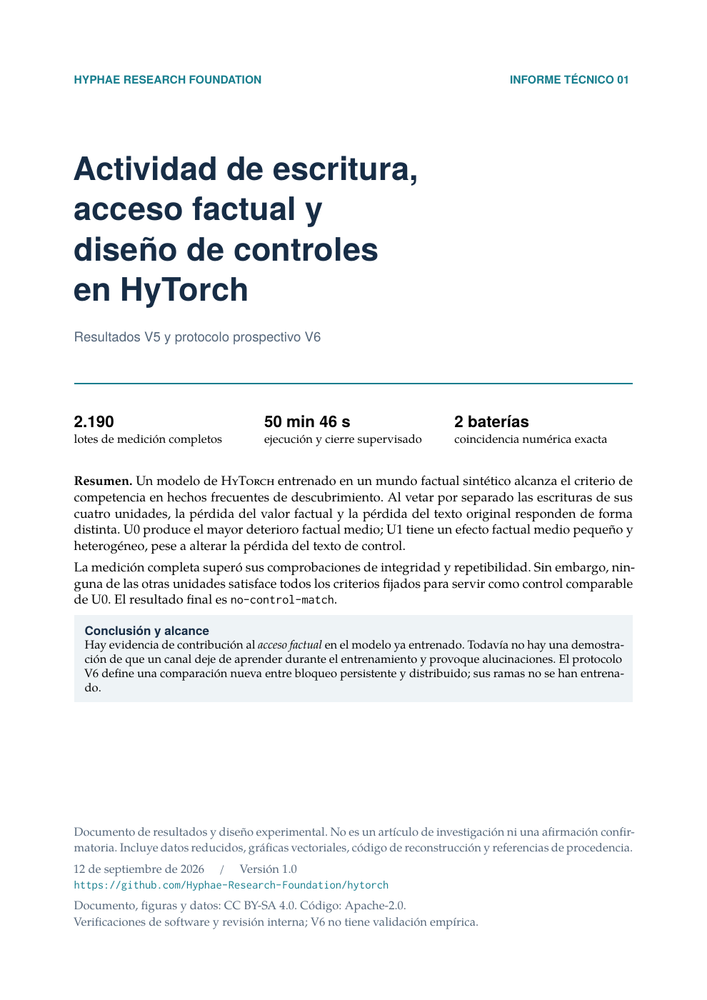

# Actividad de escritura, acceso factual y diseño de controles en HyTorch

**Informe técnico V5/V6 · 12 de septiembre de 2026 · versión 1.0**

[Leer el PDF](report.pdf) · [Fuente LaTeX](report.tex) · [Datos y procedencia](data/README.md) · [Protocolo V6 completo](design/PROTOCOLO.md)

[](report.pdf)

La medición V5 completó 2.190 lotes y dos baterías con los mismos resultados numéricos. U0 encabezó el localizador factual, pero ninguno de los otros sitios cumplió todos los criterios fijados de comparabilidad: **`no-control-match`**. El informe conserva este resultado y presenta la heterogeneidad entre hechos y posiciones.

La referencia alcanzó 94,74–100 % de exactitud en hechos frecuentes discovery; su exactitud sobre todas las preguntas fue 49,22–54,69 %. Las figuras muestran ambos alcances y sus denominadores. No se presenta la exactitud del subconjunto frecuente como exactitud global.

V6 es un **protocolo prospectivo sin entrenamiento ejecutado**: 17 ramas para comparar bloqueo persistente/concentrado con interrupciones distribuidas y rescates. El calendario balancea sitios programados; no garantiza igual daño general durante las trayectorias. Estos resultados todavía no demuestran que la muerte de canales durante el aprendizaje cause alucinaciones.

## Contenido

- Once páginas en LaTeX, con cinco figuras vectoriales y versiones PNG.
- Competencia por estrato, efectos por unidad y posición, criterios de matching y heterogeneidad de los 19 hechos frecuentes.
- Tablas completas reducidas y copia exacta del selector histórico para recalcular la selección.
- Protocolo, código y calendario V6 completos; verificadores que no cargan modelos.
- Procedencia con hashes de los originales y de sus exportaciones portables.

## Verificación sin dependencias científicas

Desde este directorio, con Python 3:

```bash
make verify
```

Esto recalcula los agregados y la selección de ambas baterías y verifica el plan V6. No ejecuta Torch, entrenamiento, generación factual ni consultas Native. El resultado esperado del selector es `no-control-match`.

## Reconstruir el PDF y las figuras

La compilación se verificó con Python 3.14, Matplotlib 3.11.1, NumPy 2.5.2 y Tectonic 0.15.0. Tectonic debe estar disponible en `PATH`; puede descargar los paquetes TeX necesarios durante la primera compilación.

```bash
python3 -m venv .venv
.venv/bin/python -m pip install -r requirements.txt
make pdf PYTHON=.venv/bin/python
```

El PDF queda en `report.pdf`; los temporales y el log en `build/`. Las cinco figuras se reconstruyen exclusivamente desde `data/report-data.json`. Las tablas científicas completas tienen una copia comprimida con gzip determinista.

La [validación de publicación](validation.json) registra la compilación en un checkout limpio: 11 páginas, todas las fuentes embebidas, sin advertencias de maquetación y 62 pruebas del calendario aprobadas. El PDF y las imágenes coincidieron byte por byte entre ambos directorios. [artifact-manifest.json](artifact-manifest.json) contiene los hashes de los archivos de esta entrega.

`make preview` reconstruye además la imagen de portada del README y requiere `pdftoppm` (Poppler). La fecha técnica de compilación está fijada mediante `SOURCE_DATE_EPOCH`; no representa una nueva fecha de medición.

Las pruebas mecánicas originales del calendario se incluyen en `design/test_control_schedule.py`. Para ejecutarlas, instalar además `pytest` en el entorno y usar:

```bash
.venv/bin/python -m pytest -q -p no:cacheprovider design/test_control_schedule.py
```

## Alcance de reproducibilidad

El paquete permite reconstruir figuras y agregados, verificar los archivos publicados y recalcular la decisión sobre las tablas completas. **No incluye** los archivos raw, checkpoints ni ledgers de la ejecución original. El contador del readback histórico registró aproximadamente 19,66 GB leídos; no representa el tamaño conjunto de toda esa evidencia. No se presenta la verificación de las tablas como una revalidación de esos originales o un replay neuronal.

`data/export_data.py` permite cotejar la exportación contra los JSON y documentos fuente fijados disponibles en un workspace histórico; no revalida blobs raw, checkpoints o ledgers. Un clon limpio usa los datos portables ya incluidos; no necesita esos originales para `make verify` o `make pdf`. Las rutas de procedencia son relativas al repositorio y no garantizan que cada artefacto histórico esté publicado en esta rama.

La calificación numérica y la integración del runner V6 siguen pendientes. Su coste base de unas 56 horas de CPU para 17 ramas es una extrapolación histórica; no incluye toda la calificación, nuevas curvas, diagnósticos y retención.

## Licencias

Informe, figuras y datos: [CC BY-SA 4.0](../../LICENSE-CC-BY-SA-4.0). Código: [Apache-2.0](../../LICENSE). Las copias históricas conservan sus contenidos y hashes originales. Esta entrega documenta resultados y diseño; no constituye revisión por pares externa ni evidencia causal confirmatoria.
